# IU Digital Radio — Documento Técnico y Guía del Proyecto

> **Institución Universitaria Digital de Antioquia (IU Digital)**  
> **Asignatura:** Programación de Dispositivos Móviles  
> **Plataforma:** Android (Kotlin Multiplatform / Jetpack Compose)  
> **Versión:** 1.0.0  
> **Autor:** William Garcia Leonel

---

## Tabla de Contenidos

1. [Resumen del Proyecto](#resumen-del-proyecto)
2. [Definición de Arquitectura](#definición-de-arquitectura)
   - [Estructura de Componentes en Jetpack Compose](#estructura-de-componentes-en-jetpack-compose)
   - [Manejo de Estado (State Management)](#manejo-de-estado-state-management)
   - [Capas de Clean Architecture](#capas-de-clean-architecture)
3. [Histograma de Funcionalidades](#histograma-de-funcionalidades)
4. [Evidencia Visual y Capturas de Pantalla](#evidencia-visual-y-capturas-de-pantalla)
   - [1. Interfaz Gráfica de Usuario (UI/UX)](#1-interfaz-gráfica-de-usuario-ui-ux)
   - [2. Cuadro de Permisos y Opciones de Fotografía](#2-cuadro-de-permisos-y-opciones-de-fotografía)
   - [3. Funcionamiento de la Cámara en Tiempo Real](#3-funcionamiento-de-la-cámara-en-tiempo-real)
   - [4. Soporte Dual: Modo Oscuro y Modo Claro](#4-soporte-dual-modo-oscuro-y-modo-claro)
   - [5. Generación del APK en Android Studio](#5-generación-del-apk-en-android-studio)
5. [Stack Tecnológico y Dependencias](#stack-tecnológico-y-dependencias)
6. [Instrucciones de Instalación y Ejecución](#instrucciones-de-instalación-y-ejecución)
7. [Estructura Limpia del Repositorio](#estructura-limpia-del-repositorio)

---

## Resumen del Proyecto

**IU Digital Radio** es una aplicación móvil nativa para Android construida con las tecnologías más modernas del ecosistema: **Jetpack Compose 100% declarativo (0 archivos XML de layout)**, **Kotlin Coroutines / Flow**, **Hilt (Inyección de Dependencias)**, **AndroidX Media3 ExoPlayer**, **Room Database** y **DataStore Preferences**.

La aplicación permite sintonizar miles de emisoras de radio en vivo a nivel mundial y regional (con especial cobertura para Colombia), visualizar las estaciones en un mapa interactivo con proyección Mercator geolocalizada, gestionar una lista de emisoras favoritas offline, buscar por texto o explorar por continentes, personalizar el perfil con captura fotográfica desde la cámara nativa o galería, y experimentar una interfaz premium basada en _Glassmorphism_ ("Aetheric Lumina") con soporte dinámico para Modo Oscuro y Modo Claro de alto contraste.

---

## Definición de Arquitectura

El proyecto está diseñado bajo los principios de **Clean Architecture** complementado con el patrón de diseño **MVI (Model-View-Intent) / MVVM (Model-View-ViewModel)** reactivo unidireccional.

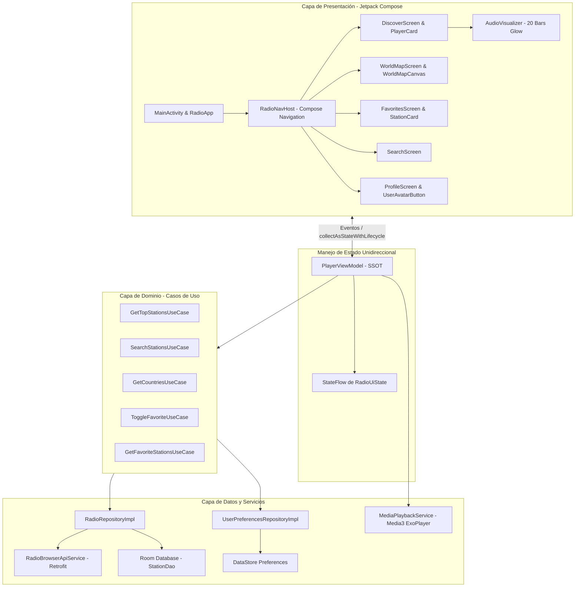

### Estructura de Componentes en Jetpack Compose

La interfaz gráfica prescinde totalmente del sistema clásico de vistas XML (`View`, `LinearLayout`, `ConstraintLayout`). Todos los elementos son funciones `@Composable` organizadas de manera modular y escalable:

1. **Contenedor Principal (`MainActivity.kt` & `RadioApp`)**:
   - Inicializa `enableEdgeToEdge()` antes de `setContent` para una experiencia inmersiva de borde a borde.
   - Utiliza un `Scaffold` con consumo estricto de `innerPadding` para evitar solapamientos con la barra de estado y la barra de navegación del sistema.
   - Aplica una capa atmosférica global en `Canvas` con halos radiales suaves (_Aetheric Lumina_).
   - Integra la barra superior `CenterAlignedTopAppBar` con el avatar del usuario interactivo y el menú contextual desplegable.
   - Presenta la barra de navegación flotante `RadioBottomNavigation` con indicadores de cápsula neón y bordes translúcidos adaptativos.

2. **Árbol de Pantallas y Navegación (`RadioNavHost.kt`)**:
   - `DiscoverScreen`: Panel principal que combina el reproductor principal (`PlayerCard`), ecualizador neón animado (`AudioVisualizer`) y lista perezosa (`LazyColumn`) de estaciones destacadas.
   - `WorldMapScreen`: Lienzo interactivo (`WorldMapCanvas`) con soporte de pan & zoom gestual mediante `graphicsLayer`, mapa de base Carto Basemaps (modo oscuro de alto contraste) y pines personalizados con icono de radio.
   - `FavoritesScreen`: Lista animada de emisoras favoritas almacenadas localmente, con eliminación instantánea y badges de bitrate.
   - `SearchScreen`: Sistema de dos pestañas: búsqueda libre reactiva en tiempo real y exploración estructurada por continentes y países.
   - `ProfileScreen`: Métricas de consumo acumulado (horas reproducidas con formato inteligente, países sintonizados y favoritas), avatar reactivo con selector de foto, y controles de configuración del sistema (Modo Oscuro, Notificaciones y Háptica).

3. **Componentes Atómicos y Moleculares**:
   - `AudioVisualizer`: Ecualizador de 20 barras simétricas con interpolación matemática armónica (`sin`), triple capa de renderizado (glow difuso exterior, cuerpo sólido y brillo especular) y compatibilidad con la API de `Visualizer` de Android.
   - `StationCard`: Tarjeta de emisora con soporte para imagen remota (Coil3), nombre, badge de bitrate en tiempo real (kbps), chip con bandera del país y acción de reproducción/favorita.
   - `PlayerCard`: Controlador maestro con botones de reproducción/pausa, anterior/siguiente, slider de volumen continuo y botón de favoritos rápido.
   - `UserAvatarButton`: Componente que encapsula la fotografía del usuario con recorte circular perfecto, borde cian neón y disparador de cuadro modal para cámara o galería.

---

### Manejo de Estado (State Management)

El manejo de estado se diseñó siguiendo el principio de **Fuente Única de la Verdad (Single Source of Truth - SSOT)**:

1. **`PlayerViewModel` y `RadioUiState`**:
   - El estado completo de la aplicación se centraliza en la clase inmutable `RadioUiState`:
     ```kotlin
     data class RadioUiState(
         val isPlaying: Boolean = false,
         val isMuted: Boolean = false,
         val selectedStation: RadioStation? = null,
         val userPhoto: Bitmap? = null,
         val stations: List<RadioStation> = emptyList(),
         val favorites: List<RadioStation> = emptyList(),
         val mapStations: List<RadioStation> = emptyList(),
         val isLoading: Boolean = false,
         val error: String? = null,
         val volume: Float = 1f,
         val searchQuery: String = "",
         val isVibrationEnabled: Boolean = true,
         val listenedSeconds: Long = 0L,
         val listenedCountries: Set<String> = emptySet(),
         val isDarkMode: Boolean = true
     )
     ```
   - El `ViewModel` expone un `StateFlow<RadioUiState>` inmutable hacia la vista.

2. **Colección Segura con el Ciclo de Vida**:
   - La UI consume el flujo utilizando `collectAsStateWithLifecycle()`, lo que detiene la emisión de eventos y el consumo de CPU cuando la aplicación entra en pausa o pasa a segundo plano.

3. **Persistencia Efímera y Rotación de Pantalla (RF-04)**:
   - Se utiliza `rememberSaveable` para estados transitorios de interfaz (menús desplegables, cuadros de diálogo, estados de scroll) garantizando que ninguna interacción se pierda al rotar el dispositivo.

4. **Doble Nivel de Persistencia Reactiva**:
   - **DataStore Preferences**: Almacenamiento clave-valor asíncrono y transaccional para preferencias de usuario (modo oscuro, feedback háptico, segundos acumulados de escucha y conjunto de países únicos sintonizados).
   - **Room Database**: Base de datos SQLite local para la persistencia del catálogo de emisoras favoritas (`StationEntity`, `StationDao`), permitiendo acceso instantáneo offline mediante flujos `Flow<List<StationEntity>>`.

---

### Capas de Clean Architecture

| Capa                         | Responsabilidad                                                                                  | Tecnologías / Clases Clave                                                                        |
| :--------------------------- | :----------------------------------------------------------------------------------------------- | :------------------------------------------------------------------------------------------------ |
| **Presentación (UI)**        | Renderizado reactivo, diseño Glassmorphism, animaciones y captura de eventos de usuario.         | Jetpack Compose, Material3, Coil3, Canvas.                                                        |
| **Presentación (ViewModel)** | Orquestación de lógica de presentación, emisión de `RadioUiState`, sincronización con ExoPlayer. | `PlayerViewModel`, `SearchViewModel`, `WorldMapViewModel`, `FavoritesViewModel`.                  |
| **Dominio (Use Cases)**      | Lógica de negocio pura, agnóstica de frameworks externos.                                        | `GetTopStationsUseCase`, `SearchStationsUseCase`, `ToggleFavoriteUseCase`, `GetCountriesUseCase`. |
| **Dominio (Modelos)**        | Entidades del negocio puras.                                                                     | `RadioStation`, `Country`.                                                                        |
| **Datos (Repositorios)**     | Abstracción de fuentes de datos (remoto/local), mapeo de DTOs a modelos de dominio.              | `RadioRepositoryImpl`, `UserPreferencesRepositoryImpl`.                                           |
| **Datos (Fuentes de Datos)** | Conexión con APIs REST y base de datos local.                                                    | `RadioBrowserApiService` (Retrofit), `RadioDatabase` (Room), `DataStore`.                         |
| **Servicios del Sistema**    | Reproducción multimedia en segundo plano con notificación en primer plano.                       | `MediaPlaybackService` (AndroidX Media3 ExoPlayer).                                               |

---

## Histograma de Funcionalidades

A continuación se presenta la matriz de cobertura funcional del proyecto, contrastando cada requerimiento con su módulo de implementación y su evidencia visual:

|    ID     | Requerimiento / Funcionalidad                                                                                           | Componente / Archivo                                     | Estado | Evidencia Visual                                                  |
| :-------: | :---------------------------------------------------------------------------------------------------------------------- | :------------------------------------------------------- | :----: | :---------------------------------------------------------------- |
| **RF-01** | **UI 100% en Jetpack Compose**<br>Cero layouts en XML, diseño fluido declarativo.                                       | `MainActivity.kt`<br>`RadioNavHost.kt`                   |  100%  | `Screenshot_1.png`<br>`Screenshot_11.png`                         |
| **RF-02** | **Perfil y Captura de Foto**<br>Avatar circular con integración a cámara nativa y galería.                              | `UserProfileHeader.kt`<br>`ProfileScreen.kt`             |  100%  | `Screenshot_8.png`<br>`Screenshot_8.4.png`<br>`Screenshot_10.png` |
| **RF-03** | **Gestión de Permisos en Runtime**<br>Solicitud de permiso `CAMERA` y manejo de denegación vía Snackbar.                | `UserAvatarButton.kt`                                    |  100%  | `Screenshot_8.png`<br>`Screenshot_8.4.png`                        |
| **RF-04** | **Manejo de Estado y Rotaciones**<br>Arquitectura reactiva con `StateFlow` y persistencia con `rememberSaveable`.       | `PlayerViewModel.kt`<br>`RadioUiState`                   |  100%  | `Screenshot_2.png`<br>`Screenshot_7.png`                          |
| **RF-05** | **Feedback Háptico Configurable**<br>Vibración háptica al sintonizar o cambiar volumen, configurable en Ajustes.        | `PlayerCard.kt`<br>`PlayerViewModel.kt`                  |  100%  | `Screenshot_7.png`<br>`Screenshot_11.png`                         |
| **RF-06** | **Catálogo y Scroll Dinámico**<br>LazyColumn optimizada con badges de bitrate, tags y banderas de países.               | `DiscoverScreen.kt`<br>`StationCard.kt`                  |  100%  | `Screenshot_1.png`<br>`Screenshot_4.png`                          |
| **RF-07** | **Reproducción Media3 ExoPlayer**<br>Streaming de audio en vivo en segundo plano mediante Foreground Service.           | `MediaPlaybackService.kt`<br>`PlayerViewModel.kt`        |  100%  | `Screenshot_2.png`                                                |
| **RF-08** | **Mapa Geográfico Interactivo**<br>Proyección Mercator en Canvas, Carto basemap y +590 emisoras geolocalizadas.         | `WorldMapScreen.kt`<br>`WorldMapCanvas.kt`               |  100%  | `Screenshot_3.png`                                                |
| **RF-09** | **Búsqueda y Exploración Continentes**<br>Pestañas de búsqueda libre y filtro jerárquico por países/continentes.        | `SearchScreen.kt`<br>`SearchViewModel.kt`                |  100%  | `Screenshot_5.png`<br>`Screenshot_6.png`                          |
| **RF-10** | **Base de Datos Local de Favoritas**<br>Almacenamiento SQLite offline de emisoras favoritas con Room.                   | `StationDao.kt`<br>`RadioDatabase.kt`                    |  100%  | `Screenshot_4.png`                                                |
| **RF-11** | **Estadísticas Dinámicas en Perfil**<br>Conteo real de tiempo escuchado, países reproducidos y favoritas vía DataStore. | `UserPreferencesRepositoryImpl.kt`<br>`ProfileScreen.kt` |  100%  | `Screenshot_7.png`<br>`Screenshot_10.png`                         |
| **RF-12** | **Soporte Tema Dual (Dark & Light)**<br>Esquemas de color adaptativos de alto contraste (WCAG AA+) con estética Glass.  | `Theme.kt`<br>`Glass.kt`<br>`Color.kt`                   |  100%  | `Screenshot_1.png`<br>`Screenshot_11.png`                         |

---

## Evidencia Visual y Capturas de Pantalla

Todas las capturas presentadas a continuación son evidencia real del funcionamiento de la aplicación en dispositivo y emulador:

### 1. Interfaz Gráfica de Usuario (UI/UX)

#### Pantalla Principal — Modo Oscuro y Visualizador Dinámico

La pantalla principal presenta una tarjeta de reproducción en vidrio translúcido con efecto _Glassmorphism_, volumen continuo, controles de transporte, visualizador neón de 20 barras y la lista de emisoras populares con banderas y metadatos en tiempo real.

|                   Descubrir — Modo Oscuro Inicial                    |                Reproductor en Vivo con Visualizador de 20 Barras                |
| :------------------------------------------------------------------: | :-----------------------------------------------------------------------------: |
|             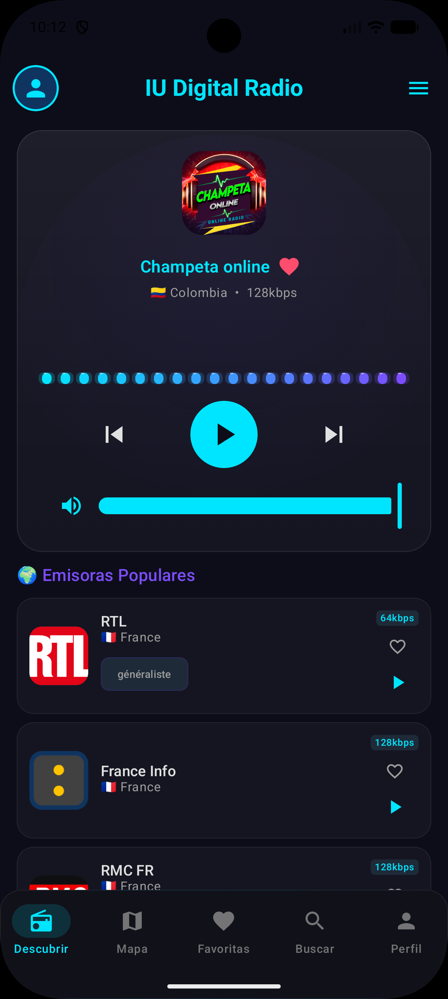             |             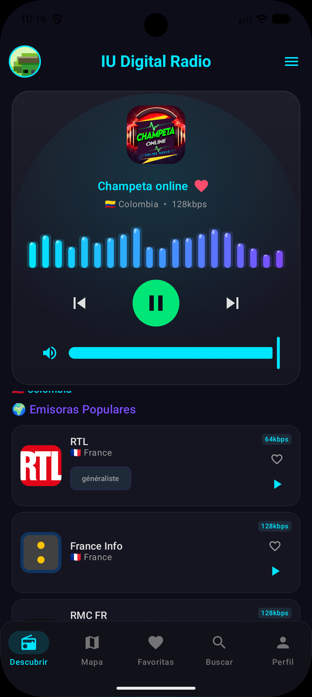              |
| _Captura 1: Estado inicial con emisora lista y lista de estaciones._ | _Captura 2: Reproducción activa con ecualizador animado y avatar sincronizado._ |

---

#### Mapa Mundial Interactivo de Emisoras y Gestión de Favoritas

El mapa renderiza más de 590 emisoras de Colombia y el Caribe sobre un fondo Carto Basemap con soporte gestual de pan y zoom. La pantalla de favoritas muestra el catálogo guardado en Room Database.

|                   Mapa Interactivo con Pines de Radio                   |              Mis Favoritas (Persistencia Local Room)               |
| :---------------------------------------------------------------------: | :----------------------------------------------------------------: |
|             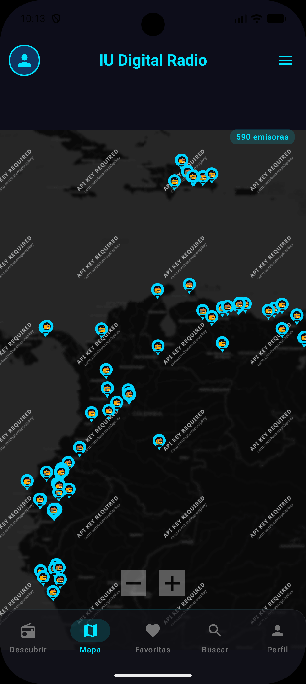             |          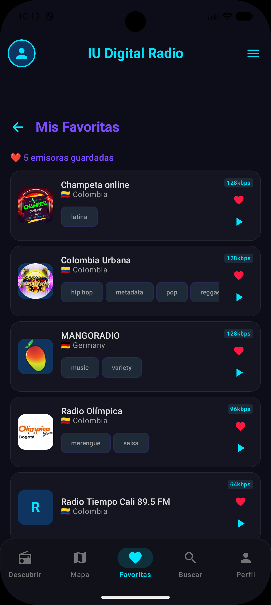          |
| _Captura 3: 590 emisoras geolocalizadas con marcadores personalizados._ | _Captura 4: Emisoras guardadas localmente con bitrates y filtros._ |

---

#### Búsqueda en Vivo y Exploración por Países

La pantalla de búsqueda cuenta con doble pestaña: búsqueda por texto en tiempo real contra la API de Radio Browser y categorización geográfica estructurada por países y número de emisoras disponibles.

|                   Búsqueda por Texto ("stereo")                    |                    Exploración por Continentes (América)                    |
| :----------------------------------------------------------------: | :-------------------------------------------------------------------------: |
|        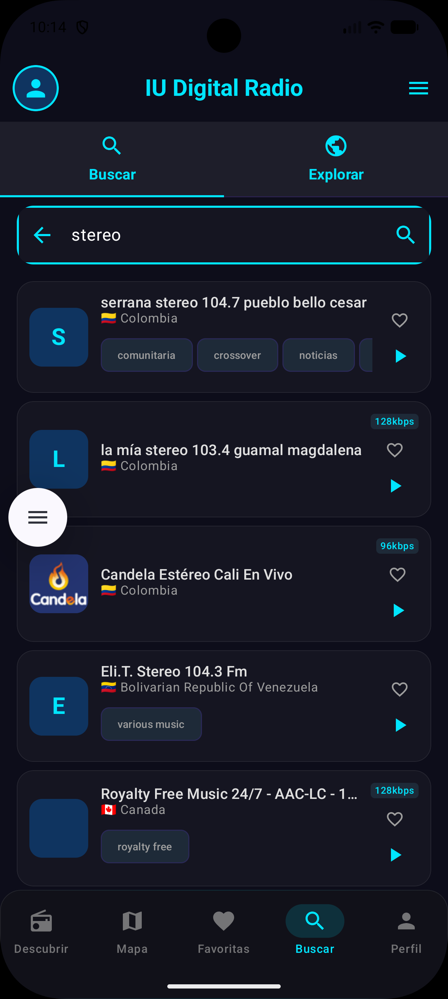         |          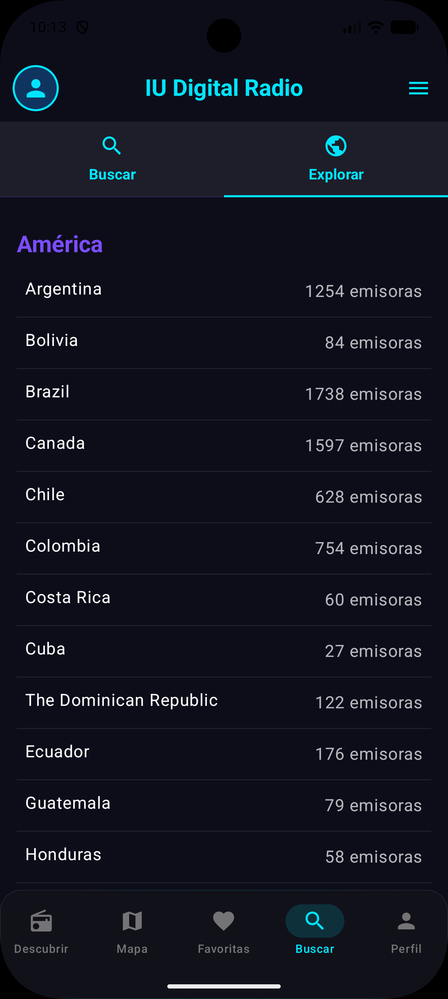          |
| _Captura 5: Resultados dinámicos con etiquetas de género musical._ | _Captura 6: Conteo de emisoras por país (Colombia 754, Brasil 1738, etc.)._ |

---

### 2. Cuadro de Permisos y Opciones de Fotografía

Al tocar el avatar circular en cualquier pantalla o en la sección de perfil, se despliega un cuadro de diálogo accesible con las opciones para tomar una foto con la cámara nativa o elegir una imagen de la galería. Si ya existe una foto, se habilita dinámicamente la opción para eliminarla.

|                Diálogo de Selección de Origen                 |               Opciones Dinámicas con Foto Existente               |
| :-----------------------------------------------------------: | :---------------------------------------------------------------: |
|      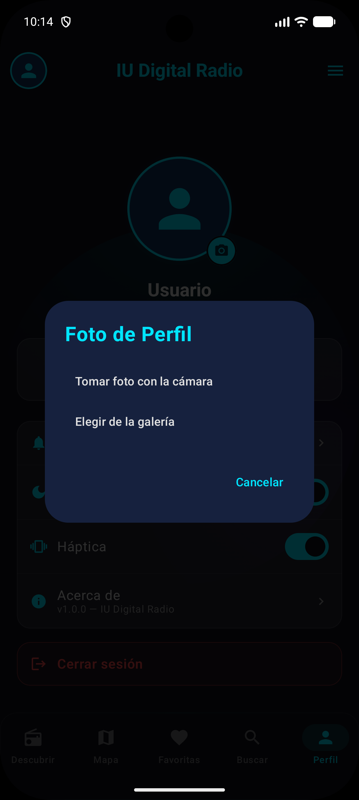      |   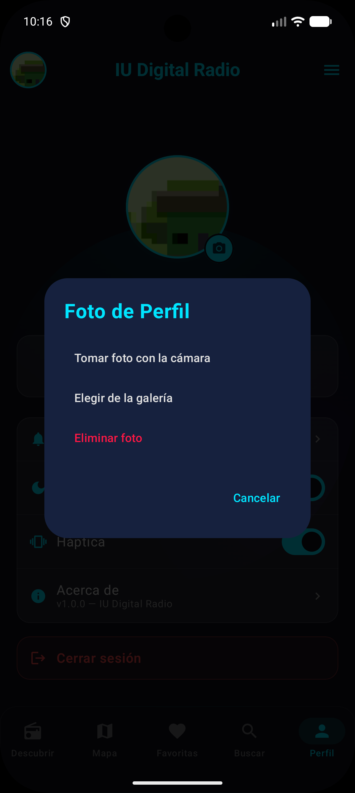   |
| _Captura 8: Modal para elegir entre Cámara nativa o Galería._ | _Captura 9: Menú reactivo que incluye la acción 'Eliminar foto'._ |

---

### 3. Funcionamiento de la Cámara en Tiempo Real

La aplicación implementa el contrato `ActivityResultContracts.TakePicturePreview()` tras validar el permiso `android.permission.CAMERA` en tiempo de ejecución. La imagen capturada se procesa y se ajusta con recorte circular perfecto tanto en el TopAppBar como en la tarjeta principal del perfil.

|           Captura Activa con la Cámara de Android            |          Perfil Actualizado con Fotografía Personalizada           |
| :----------------------------------------------------------: | :----------------------------------------------------------------: |
|      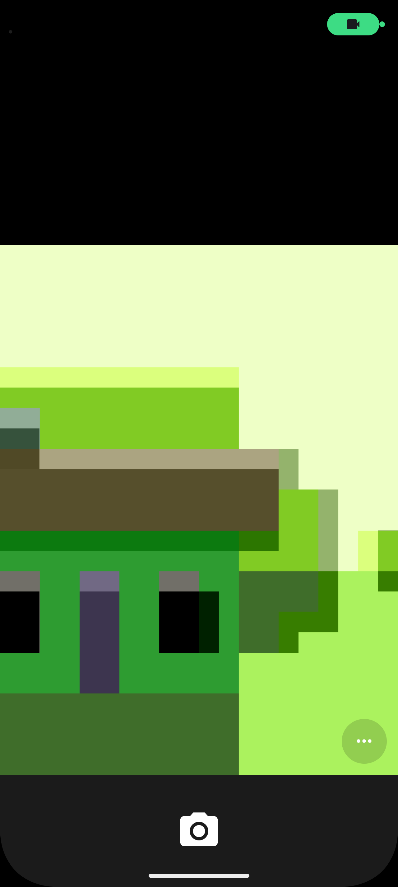      |        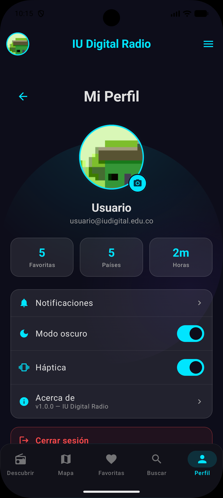         |
| _Captura 8.4: Interfaz de cámara nativa en plena ejecución._ | _Captura 10: Foto recortada y sincronizada globalmente en la app._ |

---

### 4. Soporte Dual: Modo Oscuro y Modo Claro

La aplicación cuenta con un conmutador de tema en el perfil que transforma toda la interfaz gráfica en tiempo real. En Modo Claro se aplican colores de alto contraste que cumplen con el estándar de accesibilidad **WCAG AA+** (fondos ivory pastel, tarjetas blancas puras con bordes definidos y textos de alta legibilidad).

|          Perfil en Modo Oscuro (Aetheric Dark)          |                Perfil en Modo Claro (Aetheric Light WCAG AA+)                |
| :-----------------------------------------------------: | :--------------------------------------------------------------------------: |
|  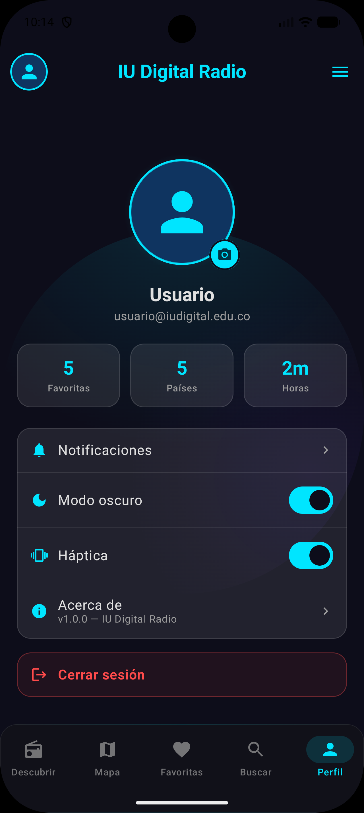  |            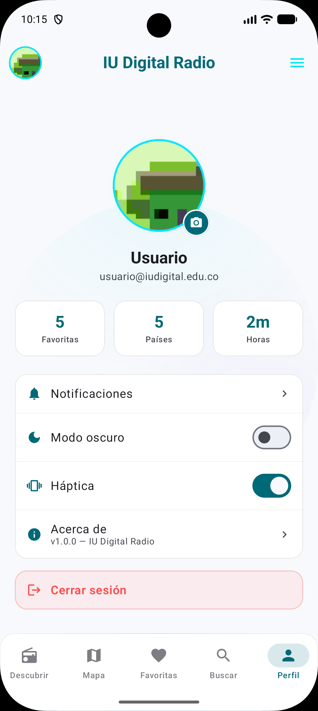             |
| _Captura 7: Tema oscuro con halos cian y violeta neón._ | _Captura 11: Tema claro de alto contraste con switches y métricas legibles._ |

---

### 5. Generación del APK en Android Studio

La compilación y generación del paquete instalable APK para Android se realiza a través de las tareas de Gradle configuradas en el proyecto.

#### Generación mediante Terminal / Consola de Comandos

Para compilar la versión de prueba (Debug) y generar el APK:

```bash
# Compilar y empaquetar APK Debug
./gradlew :androidApp:assembleDebug
```

Para generar la versión de distribución optimizada (Release):

```bash
# Compilar y empaquetar APK Release
./gradlew :androidApp:assembleRelease
```

#### Ruta del Artefacto Generado

El APK compilado con éxito se ubica en la siguiente ruta estándar de salida:

- **Ruta del binario:** `androidApp/build/outputs/apk/debug/androidApp-debug.apk`
- **Tamaño aproximado:** `80.3 MB` (incluye librerías nativas multi-arquitectura arm64-v8a, armeabi-v7a, x86_64, assets de Compose y modelos de visualización).

#### Pasos para Generar el APK en la Interfaz Gráfica de Android Studio

1. Abrir el proyecto en **Android Studio** (Ladybug / Koala o superior).
2. Esperar la sincronización exitosa de los archivos Gradle (`Sync Project with Gradle Files`).
3. En la barra de menú superior, seleccionar:  
   **Build > Build Bundle(s) / APK(s) > Build APK(s)**.
4. Una vez finalizada la tarea, hacer clic en el enlace emergente **"locate"** en la esquina inferior derecha para abrir la carpeta con el archivo `androidApp-debug.apk`.

---

## Stack Tecnológico y Dependencias

- **Lenguaje:** Kotlin 2.1+ (Kotlin Multiplatform KMP)
- **Framework de UI:** Jetpack Compose (BOM 2024.12.01) + Material3
- **Inyección de Dependencias:** Dagger Hilt 2.51.1 + Hilt Navigation Compose
- **Reproducción Multimedia:** AndroidX Media3 ExoPlayer 1.5.0 + MediaSession Foreground Service
- **Consumo de API / Networking:** Retrofit 2.11.0 + OkHttp 4.12.0 + Gson
- **Base de Datos Local:** AndroidX Room 2.6.1 (KSP) + SQLite
- **Almacenamiento de Preferencias:** AndroidX DataStore Preferences 1.1.1
- **Carga Asíncrona de Imágenes:** Coil3 Compose 3.0.4
- **Arquitectura de Navegación:** Jetpack Navigation Compose
- **Visualización de Audio:** Android AudioFx Visualizer API + Compose Canvas
- **Mapas:** Carto Basemaps API + Compose GraphicsLayer + Proyección Mercator

---

## Instrucciones de Instalación y Ejecución

### Prerrequisitos

- **JDK:** Java Development Kit 17 o 21 configurado en variables de entorno (`JAVA_HOME`).
- **Android Studio:** Ladybug, Koala o Hedgehog.
- **Android SDK:** `compileSdk = 35`, `targetSdk = 35`, `minSdk = 24`.

### Pasos de Instalación

1. **Clonar el repositorio:**

   ```bash
   git clone https://github.com/Wilgarle/IUDigitalRadio.git
   cd IUDigitalRadio
   ```

2. **Abrir en Android Studio:**
   - Seleccionar `Open` y elegir la carpeta raíz `IUDigitalRadio`.
   - Permitir la sincronización automática de Gradle.

3. **Ejecutar en Emulador o Dispositivo Físico:**
   - Conectar un dispositivo con depuración USB habilitada o iniciar un AVD con Android 8.0+ (API 26+).
   - Presionar el botón verde **Run 'androidApp'** en la barra superior o ejecutar:
     ```bash
     ./gradlew installDebug
     ```

---

## Estructura Limpia del Repositorio

El código fuente ha sido depurado por completo, eliminando archivos residuales, imports obsoletos y artefactos temporales:

```
IUDigitalRadio/
├── .gitignore                      # Configuración de exclusión para Git / GitHub
├── README.md                       # Documento Técnico oficial y guía visual
├── gradlew / gradlew.bat            # Gradle Wrapper para compilación sin dependencias previas
├── gradle/libs.versions.toml       # Catálogo centralizado de versiones y librerías
├── docs/
│   └── capturas/                   # Evidencias fotográficas organizadas del proyecto
├── androidApp/
│   ├── build.gradle.kts            # Configuración de dependencias y plugins de Android
│   └── src/main/
│       ├── AndroidManifest.xml     # Permisos (INTERNET, CAMERA, VIBRATE, FOREGROUND_SERVICE)
│       ├── res/                    # Iconos vectoriales adaptativos y recursos
│       └── kotlin/com/example/iudigitalradio/
│           ├── MainActivity.kt     # Punto de entrada Compose con Scaffold y TopAppBar
│           ├── RadioApplication.kt # Inicialización de Hilt Application
│           ├── data/               # Implementaciones de repositorios, Room y Retrofit
│           ├── di/                 # Módulos de inyección de dependencias Hilt
│           ├── domain/             # Casos de uso, interfaces y modelos de dominio
│           ├── navigation/         # NavHost y definición de rutas
│           ├── presentation/       # ViewModels y Pantallas (Discover, Map, Favs, Search, Profile)
│           └── ui/                 # Componentes Glass, AudioVisualizer y Sistema de Diseño
└── shared/                         # Módulo Kotlin Multiplatform compartido
```

---

_Desarrollado con dedicación y excelencia técnica para la **IU Digital de Antioquia**._
